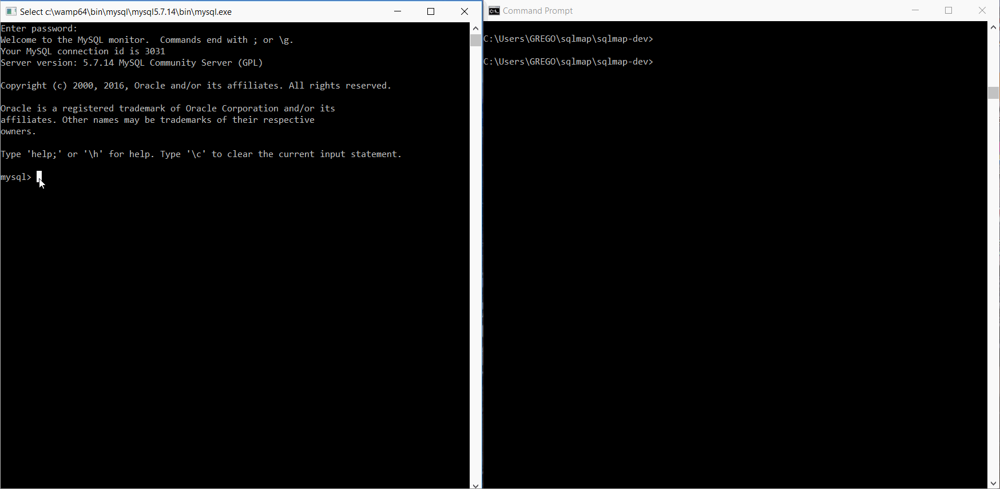

# Project 10 - Fortress Globitek

Time spent: **24** hours spent in total

> Objective: Create an intentionally vulnerable version of the Globitek application with a secret that can be stolen.

### Requirements

- [x] All source code and assets necessary for running app
- [x] `/globitek.sql` containing all required SQL, including the `secrets` table
- [x] GIF Walkthrough of compromise
- [x] Brief writeup about the vulnerabilities introduced below

### Vulnerabilities

I have implemented a SQLI vulnerebility into the web app. I have removed the mysql_real_escape_string function from the find_salesperson_by_id function. Without the mysql_real_escape_string function special SQL characters are not escaped in the string. This allows the user to inject some SQL into the url. 

With the use of the sqlmap tool an attacker is able to reach the requires table and read the information included in this table. The exact command is: **python sqlmap.py -u "http://localhost/globitek/public/salesperson.php?id=4" -D globitek_week6 -T secrets --dump** 

The value of the id variable can be different. By using this sqlmap command an attacker can also reach other tables and databases connected to the application. 

